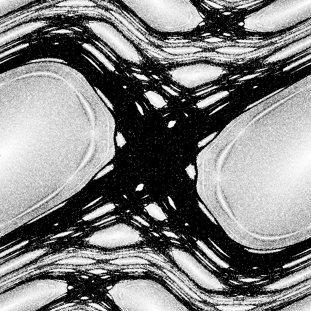

# The Standard Chirikov Map Visualization



---

## General Information

The [standard Chirikov map](https://en.wikipedia.org/wiki/Standard_map) is a
symplectic transformation of the phase plane given by formula
$$(x,y)\mapsto(x+y+\varepsilon\sin x,y+\varepsilon\sin x)$$

where $\varepsilon$ is a small parameter. This mapping is correctly restricted to a torus
when $x,y\in[-\pi;\pi)$ are taken modulo $2\pi$.

For $\varepsilon=0$ the map is linear and only periodic and quasiperiodic orbits are
possible and the map is integrable. With a non-zero value of $\varepsilon$, some of the
orbits exhibit chaotic behavior.

As $\varepsilon$ increases, the measure of the set of points with chaotic orbits increases.

The [video](http://mech.math.msu.su/~shvetz/chirikov/) visualizes this process.
Each frame corresponds to the next increasing value of $\varepsilon$. Each pixel of the
frame is shaded according to the chaoticity of the corresponding point’s orbit.

The chaoticity of the orbit is calculated as follows. Let $z$ be the starting
point of the orbit, $T$ be the Chirikov map, $n$ be the smallest natural number
such that
$$\mathrm{distance}(T^{2n}(z),T^n(z))<\rho$$
for a small positive $\rho$. The larger $n$, the darker the pixel. This method is
inspired by the [Floyd’s cycle detection
algorithm](https://en.wikipedia.org/wiki/Floyd%27s_cycle-finding_algorithm).

---

## Assembling Video

The assembling of the video is a lengthy process. It took us several months
intermittently on CPU Intel Core i9-9900K (video dimensions 1200, 6000 frames).

The UNIX-like operating system is required. Prerequisites:

* java ≥ 11
* make
* ffmpeg

Simply run
```shell
make
```

The build can be interrupted and restarted at any time.

If the build is overheating your CPU, you can limit the number of threads used:
```shell
make THREADS=4
```

Full list of variables you may want to tweak:

Description | Variable | Default value
----------- | -------- | -------------
The number of threads | `THREADS` | `0` (thread pool uses all available processors)
The video frame rate| `FRAMERATE` | `30`
Initial value of $\varepsilon$ | `INITIAL` | `0`
Final value of $\varepsilon$ | `FINAL` | `6`
Increment of $\varepsilon$ | `STEP` | `.001`
The value of $\rho$ | `RHO` | `.001`
The density (video width and height) | `DENSITY` | `1200`

## Copyright and License

© Anton Shvetz, 2022—2023

This project is licensed under the
[CC-BY-SA-4.0 License](https://creativecommons.org/licenses/by-sa/4.0/deed).

